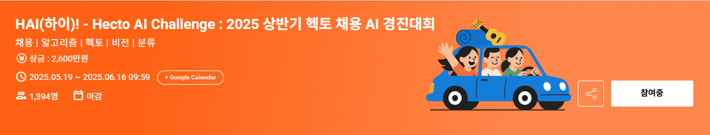

# HAI(하이)! - Hecto AI Challenge : 2025 상반기 헥토 채용 AI 경진대회

 

### 1. 대회 개요

 391 개에 이르는 fine-grained 차량 클래스의 높은 유사성과 방대한 이미지 데이터(33,000여 장)로 인해, 정교한 데이터 관리와 장기적 실험 전략이 필수적인 난이도 높은 대회였다.

- 주제: 차량 이미지 분류 (fine-grained, 391 클래스)
- 도전과제: 유사 클래스 분류, 장기 실험 관리
- 기간 : 약 1개월 (2025.05.19 ~ 2025.06.16)
- 대회 링크 : [페이지 링크](https://dacon.io/competitions/official/236493/overview/description)

### 2. 팀 구성 및 역할

- 팀장: 이재훈: 프로젝트 기획, 환경 구축, 전략 수립
- 팀원: 이혜원: 결과 분석, 하이퍼파라미터 튜닝

### 3. 활용 기술

- 실험 및 버전 관리: mlflow로 실험 기록과 코드, 결과를 일관되게 관리

.png>)

- 학습 환경: runpod의 도커 기반 Jupyter 환경에서 GPU 및 팀스페이스를 활용해 비용 효율적이고 재현성 높은 협업 환경 구축
- 기타: docker, API 자동화 등 실험적으로 적용

### 4. 데이터 및 전처리

- 전체 33,000여 장 이미지 중, 해시 기반 중복 제거 및 육안/손실값 기반 노이즈 필터링으로 약 2,000장 제거
- 원본 396개 클래스 중 유사/중복 클래스 5개를 병합하여 최종 391개 클래스로 병합

### 5. 모델링 및 학습 전략

- 교차검증: Stratified K-Fold(5-fold) 적용, 각 fold별로 ConvNeXt, EfficientNet, Swin 등 다양한 백본 구조와 AdaFace+SWA 조합으로 개별 모델 학습
- 앙상블: fold별 단일 모델 예측을 soft voting 방식으로 결합, validation LogLoss 기반 가중치(weighted ensemble) 적용해 일반화 성능 개선
- 손실함수: CrossEntropy와 FocalLoss의 조합이 다른 조합 대비 가장 우수
- 대안 모델: 계층적 추론 구조(Hierarchical Inference)도 시도했으나, 시간 제약과 검증 한계로 최종 채택하지 않음 ([참고 자료](https://github.com/With-Coding-Cat/LG_plant_disease_diagnosis_competition))

### 6. 검증 및 추론 최적화

- Test Time Augmentation(TTA): 학습시 사용한 증강 기법을 추론에도 동일하게 적용해 예측 안정성 강화
- 캘리브레이션: temperature scaling(binning+NLL 최소화)을 통한 예측 확률 보정으로 리더보드 스코어 개선

### 7. 실험 관리 및 협업

- mlflow 기반 실험 로그, 파라미터, 코드, 결과 자동화 관리로 팀원 간 실험 및 성능 공유 효율화
- runpod 팀스페이스와 컨테이너 이미지 배포로, 실험 시점에만 GPU 인스턴스를 활용해 30% 비용 절감
- 사후 검사로 t-sne 기반 시각화를 통해 유사 클래스 간 분포 분석 및 클래스 분류 체계 검토
    - t-sne + Agglomerative Clustering 을 통해 학습된 feature space 에서 분포가 과도하게 혼합된 그룹을 식별하여 재분류하고, 해당 결과를 후속 실험에 적용
        
        [tsne_anlysis](docs/t-sne.md)
        
.png>)

- docker+API 자동화 전략도 시도했으나, 실 서비스 적용에는 운영 부담 및 러닝커브 문제로 미채택

### 8. 결과 및 성과

- Private LogLoss 0.12793로 748팀 중 45위 달성(최종 제출 기준)
- 실험 기록, 협업 체계, 모델/전처리 조합의 일반화 성능을 수치로 검증

### 9. 배운 점 및 개선 방향

- MLOps 기반 실험 관리와 재현성, 협업 환경 구축의 중요성을 체감
- 세밀한 전처리와 데이터 정제가 모델 성능에 미치는 영향 확인
- 계층적 추론 모델의 실제 성능 및 한계, 데이터/모델 불확실성에 대한 대응 경험
- 반복 실험과 주관적 판단의 조화가 최종 성능 개선에 실질적으로 기여함을 이해