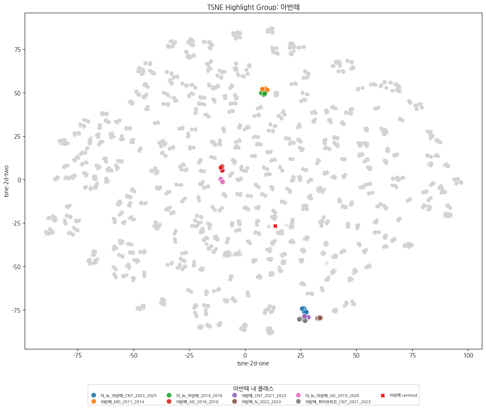

# 분류 계층 재정의 및 자동 세분화 분석

## **📌 개요**
- **문제점 :** 동일 시리즈 내 연식이 다른 차량 모델들이 외형적으로 유사해 분류 혼동이 발생하는 문제 발생
- **해결 방안 :** t-SNE 기반 시각화와 Agglomerative Clustering 을 활용해 그룹 내 분포를 분석하고, 세분화 기준을 설정하여 새로운 분류 그룹을 정의
- **활용 :** 재정의된 그룹 라벨은 이후 모델 재학습 및 오류 분석에 활용
  

## **🧩 배경 및 필요성**

제공된 원본 데이터셋은 단일 클래스(`label`) 정보만 존재하며, 차량 간 구조적 관계나 상위 분류 개념은 포함되어 있지 않았다.

이에 따라 모델 학습 전, 클래스명과 차량 이미지에 대한 육안 검토를 기반으로 차량 모델명(`model`)과 시리즈(`series`) 단위의 상위 그룹을 직접 정의하고 이를 바탕으로 계층적 분류 구조를 구성하여 학습을 수행하였다.

그러나 동일한 시리즈 내에서도 **연식이 다른 차량 모델**(예: BMW 4시리즈G22_2021_2023 와 G22_2024_2025 등)의 경우, 외형이 유사하여 모델이 이를 명확히 구분하지 못하는 문제가 발생하였다. 또한 이러한 클래스들이 학습된 feature embedding 공간에서도 서로 인접하게 분포되는 현상이 관찰되었고, 따라서 **동일 시리즈 내에서의 그룹을 더욱 세분화**하고 **그룹 단위로 다른 가중치 파라미터를 부여하는 등의 세밀한 학습 전략**이 필요함을 느꼈다.
 

## **🔍 실험 절차**

### **1. t-sne 기반 군집 확인**

학습된 모델의 feature embedding을 추출한 후, `t-SNE` 를 활용하여 2차원 시각화를 수행하였다.

이를 통해 동일 `series` 내의 여러 차량 `model`들이 실제 feature space 상에서 얼마나 구분되는지를 육안으로 확인하였고, 특히 외형이 유사한 `model`들이 하나의 `series`로 묶여 있을 경우 겹치는 군집을 형성하는 현상이 여러 `series` 에서 관찰되었다.

> 아반떼 시리즈에 해당하는 모델들을 하이라이팅한 t-sne 시각화 결과. 
각 모델은 서로 다른 색상으로 구분되며 빨간색 x 표시는 시리즈 전체의 중심점(centroid)를 나타낸다. 대표적으로 `아반떼_CN7`, `아반떼`, `아반떼_N` 이 서로 근접한 feature 위치에 분포하고 있음을 확인할 수 있다. 

### **2. 거리 기반 정량 분석 및 이상 그룹에 대한 세분화 기준 설정** 

시각화 이후 각 `series` 내 `model`의 t-SNE 중심 좌표(centroid)를 계산한 뒤, 다음과 같은 거리 기반 정량 분석을 수행하였다.

- **동일 시리즈 내 평균/최소 거리** : 동일 시리즈 내 모델 간 응집도 및 분리도 평가
- **다른 시리즈 간 최소 거리** : 시리즈 간 경계 중첩 여부 평가

분석 결과, 전체 시리즈 그룹 중 응집도가 높은 상위 50%의 그룹들이 **중심점 간 최소 거리(`min_intra_dist`) ≤ 5.2 구간에 집중**되어 있음을 확인하였다. 

이에 따라 `min_intra_dist ≤ 5.2` 를 기준으로 전체 시리즈에 대해 AgglomerativeClustring 를 적용하여 동일 시리즈 내에서의 세분화를 수행하였다.